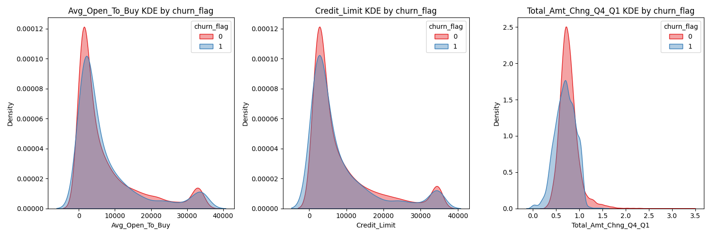
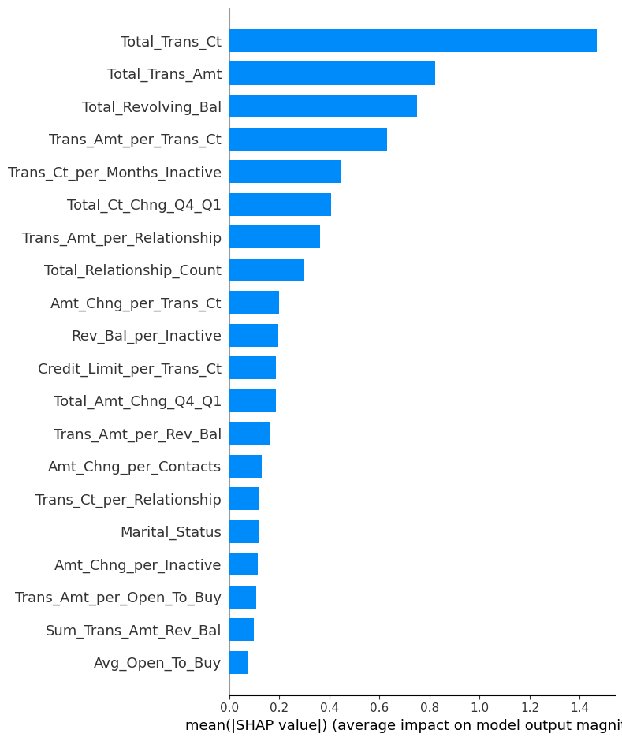
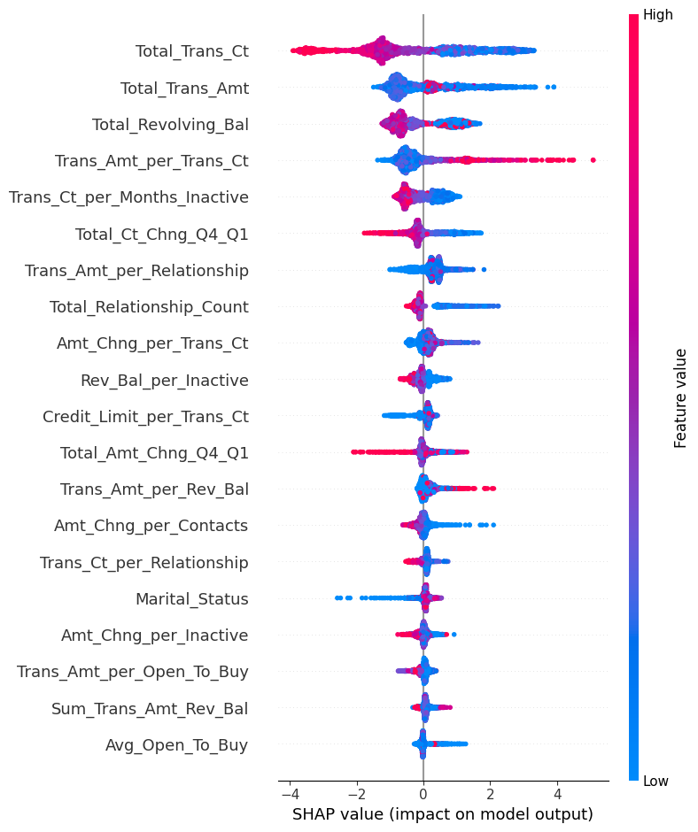
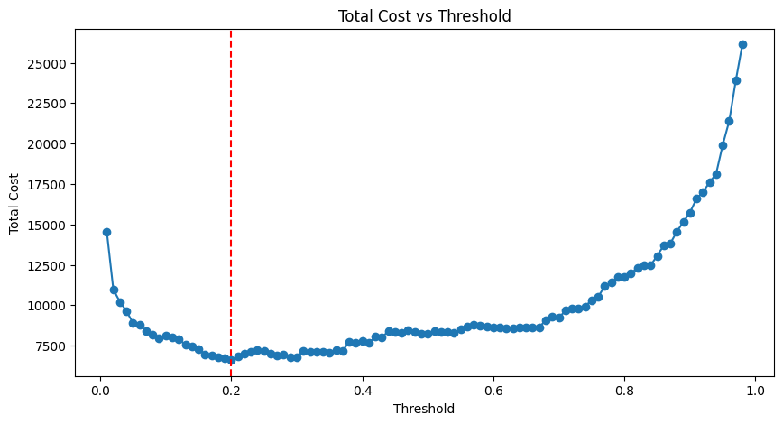

# Credit Card Churn Prediction Project

## 1. Executive Summary
Customer attrition is one of the most pressing threats to long-term profitability in the credit card industry. Acquiring a new customer can cost up to five times more than retaining an existing one. Therefore, understanding which customers are likely to churn—and why—is crucial for effective retention and revenue protection. This project presents an end-to-end customer churn prediction pipeline tailored for the credit card business. The solution combines exploratory data analysis (EDA), business-centric feature engineering, cost-sensitive modeling, and explainable AI (SHAP) to deliver actionable insights and a deployable model that aligns with business impact.

I used real-world credit card customer data to explore behavioral patterns, usage metrics, and demographic signals that influence churn. Our EDA uncovered strong churn predictors such as transaction inactivity, low card utilization, and low engagement across bank relationships. These insights guided a targeted feature engineering phase, where ratio-based and customer-centric features were created to enhance signal strength.

To prioritize business value over abstract model accuracy, we designed a cost matrix using guesstimates of customer lifetime value (CLV) and campaign costs. This matrix was used to:
* Guide Recursive Feature Elimination (RFE) for removing features with low business impact.
* Tune the model's prediction threshold to reduce the overall financial loss from incorrect predictions.

The resulting LightGBM model achieved a 75% reduction in business loss, bringing the expected cost of misclassification down from ₹30,000 to ₹7,442. This optimization was driven not just by improving precision or recall but by aligning the model’s behavior with business economics. To ensure transparency and adoption by non-technical teams, we incorporated SHAP (SHapley Additive exPlanations) to explain each individual prediction. This allows the Customer Support and Marketing teams to understand the "why" behind each churn risk score and tailor retention actions accordingly. Finally, the pipeline was deployed as a custom Streamlit dashboard designed for use by customer-facing teams. The application allows users to:
* Input or search for customer profiles,
* View churn probability scores and alerts,
* Explore top contributing factors through SHAP visualizations, and
* Make informed, data-driven retention decisions.

---

## 2. Problem Statement

A bank manager is troubled with customers quitting on credit card services. The goal is to predict which customers are likely to churn so proactive steps can be taken to retain them.

### Project Aim

1. Predict the probability of churn for each customer.
2. Identify key reasons behind churn using model interpretability.

### Why Probability?

- Enables flexible thresholding based on cost, risk, and card type.
- Allows ranking customers for targeted retention efforts.

### Benefits of the Project

- Improved customer experience and retention
- Revenue protection and churn cost minimization
- Targeted marketing strategies
- Reduced marketing spend and operational costs

---

## 3. Skills Demonstrated

- **Data Analysis & Visualization:** `pandas`, `matplotlib`, `seaborn`
- **Machine Learning & Feature Selection:** `sklearn`, `LightGBM`, `RFE`
- **Explainability:** `SHAP`
- **Cost-Based Guesstimation & Business Modeling**
- **Model Deployment:** `Streamlit`, `FastAPI`
- **Version Control & Project Structuring:** `Git`, `GitHub`, `VSCode`
- **End-to-End Pipeline Design**
- **Soft Skills:** Business problem understanding, assumption-based modeling, storytelling

---

## 4. Methodology Summary

I followed the CRISP-DM framework:

1. **Business Understanding:** Churned customers affect revenue. Need to predict churn risk early.
2. **Data Understanding & Preparation:** Exploratory analysis, feature cleaning, missing handling.
3. **Feature Engineering:** Created over 15+ ratio/sum-based business features.
4. **Modeling:** LightGBM, cost matrix–based feature selection, threshold tuning.
5. **Evaluation:** Standard metrics + cost-based decision optimization.
6. **Deployment:** Streamlit dashboard with interpretability tools.

---

## 5. Key Findings from EDA

### Gender Analysis

- Women had higher churn rates despite higher transaction activity.
- Women overrepresented in unknown income category and platinum card usage.

#### Plots:

  

---

### Card Category

- `premium_flag` feature revealed Platinum cardholders had the highest churn risk.
- Silver cards performed best; Gold was underutilized.

#### Plot:

---

### Relationship Count

- Customers with <3 relationships had double the churn rate.

---

### Contact Count & Service Quality

- Higher contact counts correlated with increased churn risk.

#### Plot:

---

### Inactive Months

- 3+ months of inactivity significantly increased churn probability.
- Month 4 had the sharpest churn spike.

#### Plots:
 

---

### Numeric Continuous Features

- Strong churn indicators: Total transaction count/amount, utilization ratio, revolving balance.
- Engineered features amplified churn separability.

#### Plots:
  

---

## 6. Modeling Outcomes

- Final model: **LightGBM**, trained on cost-optimized features.
- Class imbalance addressed using class weights.
- Recursive Feature Elimination (RFE) performed using business cost matrix.
- **SHAP** used to evaluate feature contribution.

### Final Performance

| Metric               | Value        |
|----------------------|--------------|
| ROC-AUC              | ~0.99        |
| Business Cost Saved  | ₹22,558      |
| Final Loss Estimate  | ₹7,442       |
| Initial Estimate     | ₹30,000      |

---

### SHAP Analysis

**Top Features** :
- `Total_Trans_Ct`, `Total_Trans_Amt`, `Avg_Utilization_Ratio`, `Trans_Amt_per_Trans_Ct`

**Beeswarm Plot** :
- High transaction activity reduces churn risk.
- Low engagement indicators push the model toward churn prediction.

---

## 7. Cost-Based Optimization Strategy

Instead of optimizing solely on accuracy, I optimized the model on **cost**, using:

### Guesstimate-Based Assumptions

- **False Negatives (missed churners):** Loss = Customer Lifetime Value (CLV)
- **False Positives (wrongly flagged loyal users):** Loss = Marketing Spend

| Card Category | FN Cost (CLV) | FP Cost (Marketing Spend) |
|---------------|----------------|-----------------------------|
| Blue          | ₹212.68        | ₹50                        |
| Silver        | ₹338.02        | ₹100                       |
| Gold          | ₹366.75        | ₹200                       |
| Platinum      | ₹446.88        | ₹300                       |

CLV = Avg Monthly Spend × Margin × Tenure  
Assumed margin = 5%

### Outcome

- Final threshold chosen to minimize expected cost.
- Led to **75% reduction** in estimated churn-related losses.

---

## 8. Actionable Recommendations

- **Boost relationship count** for customers with <3 accounts.
- **Offer retention incentives** to high-spending Platinum customers.
- **Target women in low-income segments** with higher credit limits and offers.
- **Monitor inactivity closely** and trigger automated interventions at month 3.
- **Reduce unnecessary customer contacts** via improved self-service portals.

---

## 9. Estimated Business Impact

- **Business Cost Reduction:**  
  Initial churn-related cost estimate = ₹30,000  
  Final cost post-optimization = ₹7,442  
  **→ Cost savings of ₹22,558 (~75%)**

- **Retention Efficiency:**  
  Focused targeting using churn probability + cost thresholds enables:
  - Better resource allocation (especially for premium card tiers)
  - Reduced retention campaign wastage

- **Customer Engagement:**  
  Streamlit dashboard with explainability builds trust with internal teams, improves support agent decisions, and enables:
  - Transparent churn reasoning for non-technical staff
  - Direct link between model output and actionable customer features

- **Scalable Deployment:**  
  With integrated FastAPI backend and modular pipeline, the solution can be scaled for future datasets and integrated with CRM systems.

---

## 10. Limitations and Next Steps

### Limitations

- **Static Dataset:**  
  Dataset is not time-series based, limiting understanding of customer evolution over time.

- **Business Assumptions:**  
  CLV, revenue margins, and marketing spend are **guesstimates** and may not fully reflect actual costs or profit margins.

- **Lack of Real-time Data:**  
  Transaction data is **historical** and not connected to real-time customer activity streams.

- **Unstructured Data Excluded:**  
  No sentiment analysis, customer complaints, or call transcripts are used.

### Next Steps

- **Temporal Modeling:**  
  Explore **sequence models (e.g., LSTM, Transformers)** for better churn trajectory modeling over time.

- **Business Integration:**  
  Plug model into CRM pipelines and validate predictions with actual churn cases.

- **Retention Strategy Testing:**  
  Conduct **A/B testing** on multiple customer segments to test different interventions.

- **Alerting System:**  
  Build an **alert dashboard** for customer support agents to act when churn probability > threshold.

- **Data Expansion:**  
  Incorporate behavioral/sentiment/interaction data for deeper signals of dissatisfaction.

---

## 11. Dashboard Explainability (Streamlit App)

The final solution includes an interactive web application built with **Streamlit**. Key features include:

- **Churn Probability:** Real-time churn prediction per customer.
- **SHAP Interpretability:**
  - Global feature importance
  - Individual-level SHAP waterfall plots
  - Explains why a specific customer is at risk  
    
- **Customer Profile Viewer:**  
    

---

## 12. App Structure & Usage

pip install -r requirements.txt

cd app

streamlit run app.py

uvicorn backend:app --reload

---
## 13. Contact Me
Email: amogh2048@gmail.com 
LinkedIn: linkedin.com/in/amogh-kahalekar
Instagram: @amoghkahalekar

